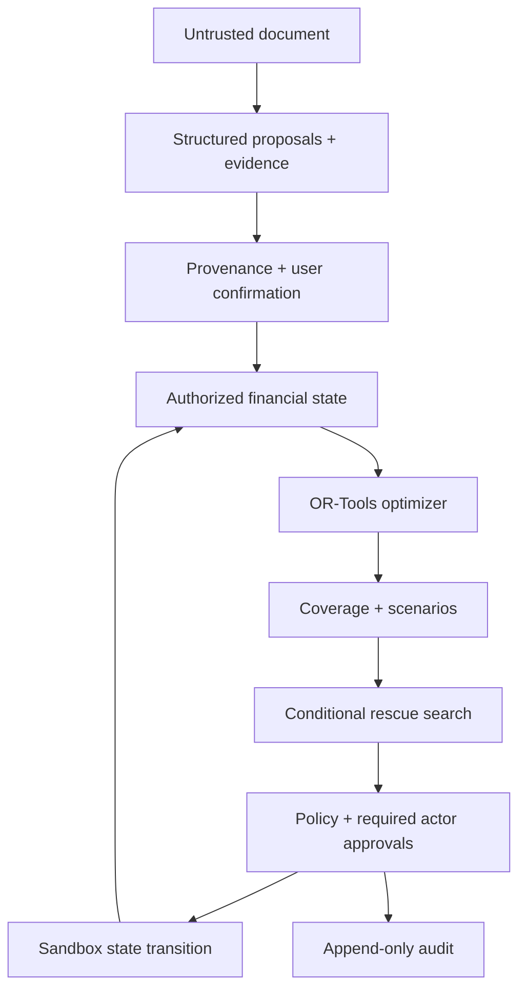

# Architecture and financial invariants

LATTICE has separate understanding, planning, authorization and execution boundaries. The current provider is a deterministic parser of labelled text, not a live language model. It receives strings/blocks and returns Pydantic proposals; it receives no database session, tool registry, credential or action capability.

## Domain and persistence

Sixteen SQLAlchemy tables cover Actor, AuthSession, Permission, Document, DocumentBlock, FinancialFact, FundingSource, Obligation, TransferRoute, Plan, PlanAllocation, ScenarioRun, ScenarioResult, InterventionCandidate, PreparedAction and AuditEvent. The frozen initial Alembic revision explicitly creates the schema and audit UPDATE/DELETE guards. Migration drift is checked against the model on fresh PostgreSQL.

Each plan stores a version, immutable-style input snapshot and canonical SHA-256 state hash. Financial changes invalidate current plans and prepared approvals, generate a replacement when a prior plan exists, and rerun a 100-iteration comparison. A detailed user-requested scenario defaults to 1,000 iterations. Beneficiary changes and permission changes also invalidate dependent state.

The graph API derives actor ownership nodes, funding nodes, obligation nodes and allocation edges from the same authorized state and plan. Allocation inspector data contains source/destination amount, route, schedule, arrival, verification and risk. Transfer routes are edge attributes rather than extra account nodes.

## Monetary model

Supported currencies: EUR, USD, VND, GBP. EUR/USD/GBP use 100 minor units; VND uses 1. Amount input validates precision rather than silently rounding user money. The optimizer uses integer minor units and rational FX/fee coefficients. A route fixed fee and percentage fee consume source currency; the destination amount is rounded down to its minor unit. Fees round up.

For source `j`, route `k`, obligation `i`, principal `p`, route-use binary `y`, fee `f`, destination `d`:

- `p >= max(1, ceil(route_min * source_scale)) * y`.
- `p <= floor(route_max * source_scale) * y`.
- `f = ceil(p * percentage_fee) + ceil(fixed_fee * source_scale) * y`.
- `d = floor(p * fx_rate * (1 - markup) * destination_scale / source_scale)`.
- Sum of principal and fees from a source is at most its balance minus protected minimum.
- Sum of destination amounts for an obligation plus nonnegative shortfall equals its amount; no overpayment is possible.
- Candidate arcs exist only for matching currencies, verified available routes, verified commitments with verified beneficiaries and no security hold, usable funding, ownership permission and compatible source restrictions.
- `max(as_of, available_from) + settlement_p95_days <= obligation_due_date` for every emitted allocation.
- Emergency sources are excluded until an explicitly approved reserve-release intervention changes their state.

Lexicographic solves minimize uncovered value, then uncertain allocation value at each priority (CRITICAL, HIGH, NORMAL, OPTIONAL), followed by near-deadline timing exposure and base-EUR source expenditure. Thus financial cost never outweighs a feasible critical commitment. A time-limited feasible solve is labelled FEASIBLE, not OPTIMAL. If no validated solver result exists, the result contains no allocations and an error. A separate post-solve validator rechecks trust, authorization, budget, reserve, currency, timing, route bounds, fees and destination conservation.

Fixed demo EUR valuations are EUR 1, USD .90, GBP 1.17 and VND .000036. They support objective comparability and UI aggregates; they are not live FX quotes. Reported route cost includes explicit fees plus quoted FX markup loss. These valuations can differ from an individual route's quote.

Insufficient funding returns a gap-bearing plan, not a false certificate of feasibility. Partial allocations can describe coverage even if partial payment is not allowed; the action layer refuses payment until the obligation has full on-time verified coverage. Installments are explicit changed obligations after simulated institution consent.

## Coverage and liquidity

For obligation amount `A`:

- **Nominal:** all planned destination amounts / A, capped at 1; expected/conditional funds can contribute to forecast allocations.
- **Verified:** only confirmed/source-verified funding whose status is AVAILABLE or PLANNED, with necessary authority.
- **On-Time Verified:** verified destination amounts whose arrival is on or before the deadline / A.

A confirmed scholarship notice does not prove receipt: its source remains EXPECTED and does not increase verified coverage. A manually attested received balance can be AVAILABLE, with an explicit confirmation note. PLANNED parent contributions are conditional on the funding owner's authorization and quoted settlement, and payment execution still requires that owner's approval.

Safe-to-spend is secondary: confirmed AVAILABLE student funds, already available by the planning clock, minus principal, fees and protected minimums. EXPECTED, PLANNED, conditional, restricted and parent-owned money is excluded from this liquid metric.

Financial amounts are summed with Decimal before coverage ratios are serialized. The Overview aggregates coverage by demo-EUR value, not by adding unrelated currency units. SAFE means critical obligations inside the stated horizon are verified and on time; it does not certify later debts or eliminate stochastic risk.

## Scenarios and rescue

NumPy uses a fixed seed and sampled delays/FX/expense magnitudes bounded by controls. It changes arrival times, conversion receipts and selected cancellations, then recalculates coverage of the existing allocations. Scenario Failure Rate includes any existing verified gap. Forecast Failure Rate separately assumes expected income arrives. The before/after chart applies the maximum selected shocks; distribution metrics use all sampled iterations.

Rescue enumerates applicable reallocation, installment, reserve-release, optional deferral, deadline extension and expedited-dispatch variants. Each variant searches the minimum additional family contribution to one EUR cent using the optimizer. A pure unchanged-state funding increase is named INCREASE_FAMILY_TRANSFER. All installment principal, deferred debts and institution fees remain represented. Extensions keep critical debt inside the horizon.

Score = institution fees + family contribution × 0.08 + released reserve × 0.15 + friction × 10 by default. Weights are environment-configurable. Scenario failure, people involved and assumptions are displayed separately. It is the minimum among evaluated bundles, not an unrestricted global optimization over every possible combination. Additional family money is a disclosed hypothetical EUR receipt and is never silently made real.

## Policy and execution

P0 view and P1 analysis are API-authorized by role/resource. PreparedAction starts at P2. Payment preparation freezes beneficiary, obligation version, allocations, required source owners and current state hash. P3 execution requires every approval, a matching state hash, no security hold and preserved reserves. Execution changes simulated balances/status, generates a sandbox receipt and replans. An executed action cannot execute twice. P4 real-money execution is absent.

APPROVE_OWN_FUNDS controls planning authorization, not substitution for execution consent. APPROVE_ACTION adds an approver and clears previous approvals; it never removes required owners. Revocation removes only the delegated approver and requires fresh base approvals. APPROVE_PLAN permits activation without granting private plan data. Parent action responses expose only their contribution and approval status.

PostgreSQL advisory transaction locking occurs before mutation reads and serializes financial changes across workers. The single-process ASGI write guard also serializes demo mutations. The local portable database uses a one-connection pool; no high-concurrency performance claim is made.
